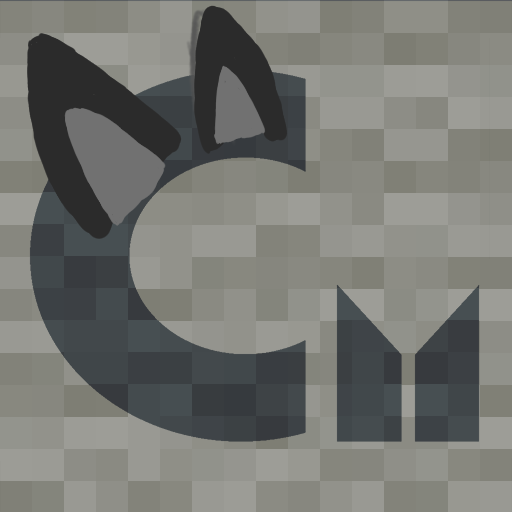

# Carpet Nukos Addition

A Carpet extension mod developed to meet the needs of the Nukoland
Minecraft server.

 \

***English*** | [中文](./index.zh.md)

[Features](./features.md) | [Settings](./rules.md)

## Features Included / WIP

Legend: \
✅ Included \
✳️ Not applicable for this version \
❌ Not included

| Features                                  | 1.20.1  |
|:------------------------------------------|:--------|
| Anvil Item Cost Rollup Algorithm          | ✅ 0.1.0 |
| Anvil Algorithm                           | ✅ 0.2.0 |
| Anvil Use Item Cost                       | ✅ 0.2.0 |
| Anvil Rename Cost                         | ✅ 0.2.0 |
| Anvil Too Expensive Limit                 | ✅ 0.2.0 |
| Anvil Custom Name Format                  | ✅ 0.4.0 |
| Anvil Custom Name Length                  | ❌       |
| Iron Block Repair for Anvils              | ✅ 0.5.0 |
| Anvil-Related Client Patches              | ✅ 0.4.2 |
| Auto Freeze Ticking When No Players       | ✅ 0.1.0 |
| Auto Freeze Ticking Related Scripts       | ✅ 0.7.0 |
| Auto Freeze Ticking Use Deep Freeze       | ✅ 0.6.0 |
| Ignore Players in Auto Tick Freeze        | ✅ 0.6.0 |
| Ignore Players when Sleeping              | ✅ 0.6.0 |
| Tick Status Sync Patch for Carpet Clients | ✅ 0.1.1 |
| Display Pet Health                        | ❌       |
| Pet Friendly Fire Protection              | ❌       |
| Pet Owner Transferable                    | ❌       |

## Changelogs

See [GitHub Releases](https://github.com/suk-ws/carpet-nukos-addition/releases) or the version history on various platforms.
